# Database 설계

---

## 외래키

- 정의: 테이블 간의 관계를 나타낼 때 사용하는 키 / 다른 테이블의 기본키를 참조하여 하여 사용하는 키

- 특징

      1. 한 테이블의 외래키는 연결되어 있는 다른 테이블의 기본키 중 하나
      2. 데이터 무결정 유지 => 참조 무결성: 자식 테이블의 레코드 삭제 및 업데이트 시 부모 테이블의 기본키 참조하지 않을 시 오류
      3. 테이블 간의 관계를 정의할 수 있으며, 다수의 테이블에서 데이터를 쉽게 검색하고 조인할 수 있음.

- CREATE 문으로 FK 설정

  ```
  CREATE TABLE child_table (
      child_column INT NOT NULL,
      ...
      FOREIGN KEY (child_column) REFERENCES parent_table(parent_column) # parent_table 부모 테이블
  );
  ```

- ALTER 문으로 FK 설정

  ```
  ALTER TABLE child_table   # 자식 테이블
  ADD CONSTRAINT fk_constraint_name # fk_constraint_name foreign key 제약 조건의 이름
  FOREIGN KEY (child_column)  # 자식테이블에서 외래키로 사용될 컬럼
  REFERENCES parent_table(parent_column);  # 부모 테이블의 컬럼 이름
  ```

  ```
  ALTER TABLE orders
  ADD CONSTRAINT fk_customer_id
  FOREIGN KEY (customer_id) REFERENCES customers(id);
  ```

- DROP 이용하여 FK 삭제

  ```
  ALTER TABLE orders DROP FOREIGN KEY fk_customer_id;
  ```

- FK 제약조건

  - 설정 이유: FK 제약 조건에 의해 참조되는 테이블에서 데이터의 수정이나 삭제 발생 시, 참조하고 있는 테이블의 데이터도 같이 변화

        - 키워드 정리

          - ON DELETE: 외래키가 참조하는 테이블 행이 삭제될 때 실행되는 동작을 지정
              1. CASCADE: 외래키가 참조하는 모든 행도 함께 삭제
              2.  SET NULL: 외래키 값을 NULL로 설정 (자식 외래키가 NOT NULL일 시 설정 불가)
              3. SET DEFAULT: 외래키 값을 기본값으로 설정 (InnoDB 엔진에서 사용 불가)
              4. RESTRICT: 외래키가 참조하는 행이 있으면 삭제 거부

          - ON UPDATE: 외래키가 참조하는 테이블의 행이 업데이트될 때 실행되는 동작을 지정
              1.  CASCADE: 외래키가 참조하는 모든 행도 함께 업데이트
              2. SET NULL: 외래키 값을 NULL로 설정(자식 외래키가 NOT NULL일 시 설정 불가)
              3. SET DEFAULT: 외래키 값을 기본값으로 설정 (InnoDB 엔진에서 사용 불가)
              4. RESTRICT: 외래키가 참조하는 행이 있으면 삭제 거부

- FK 제약 조건 예시: 주문(order) 테이블에서 고객(customer) 테이블의 ID를 참조하는 외래키 제약조건 설정

  ```
    CREATE TABLE customer (
      id INT PRIMARY KEY,
      name VARCHAR(50)
    );


    CREATE TABLE orders (
      id INT PRIMARY KEY,
      customer_id INT,
      amount DECIMAL(10,2),
      FOREIGN KEY (customer_id) REFERENCES customer(id) ON DELETE CASCADE ON UPDATE CASCADE
    );
  ```

---

## 기본키

- 정의: 특정 레코드를 유일하게 식별하기 위해 사용되는 필드 / 테이블에서 각 레코드를 식별하는 데 사용하여 반드시 존재

- 특징

  1. 각 레코드에 대해 고유성
  2. _NOT NULL_

- CREATE 시 사용 방법

  ```
  CREATE TABLE  users(
    id INT PRIMARY KEY,
    name VARCHAR(50),
    email VARCHAR(100),
    password VARCHAR(50)
  );
  ```

  ```
  CREATE TABLE users (
    id INT NOT NULL,
    name VARCHAR(50),
    email VARCHAR(100),
    password VARCHAR(50),
    PRIMARY KEY (id)
  );
  ```

- ALTER 시 사용 방법

  1. PK 삭제

     ```
     ALTER TABLE users DROP PRIMARY KEY;
     ```

  2. PK 생성
     ```
     ALTER TABLE users ADD PRIMARY KEY (name);
     ```

---

## ER 다이어그램 (Entity Relationship Diagram)

- 정의: 데이터들의 관계를 나타낸 도표

- ERD 규칙

  </img> <br/>

  - 설명  
    A는 부모, B는 자식의 관계를 가진 ERD. (~ 구성되어 있다. = ~ 포함하고 있다. ) <br/>
    A 테이블의 PK를 B 테이블이 FK로 가지고 있다는 것이 부모와 자식 테이블의 의미이다. <br/>
    실선은 부모 테이블의 PK를 자식 테이블이 가지고 있으며 이 키를 자신의 FK이자 PK로 사용하는 경우이고 <br/>
    점선은 부모 테이블의 PK를 자식 테이블이 가지고 있지만 이를 PK로 사용하지 않을 때 사용한다. <br/>

- ERD 예시

  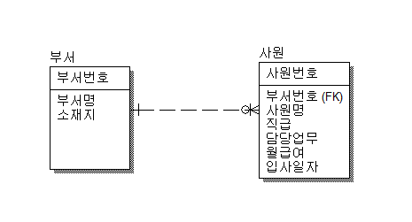 </img> <br/>

  - 설명  
    부서 테이블(부모)과 사원 테이블(자식)의 관계를 가진 ERD <br/>
    점선이기에 사원 테이블이 부서 테이블의 PK를 FK로 연결하였지만, 자신의 PK로는 사용하지 않음. <br/>
    해당 관계의 설명: 하나의 부서는 0~N명의 사원을 가지며, 사원 테이블은 부서 테이블의 PK인 부서번호를 FK로 가짐. <br/>

- 참조 링크: [DE_Diagram 설명](https://inpa.tistory.com/entry/DB-%F0%9F%93%9A-%EB%8D%B0%EC%9D%B4%ED%84%B0-%EB%AA%A8%EB%8D%B8%EB%A7%81-1N-%EA%B4%80%EA%B3%84-%F0%9F%93%88-ERD-%EB%8B%A4%EC%9D%B4%EC%96%B4%EA%B7%B8%EB%9E%A8)

---

## 복합 키

- 정의: 여러 개의 컬럼으로 하나의 기본키(PK)로 지정하는 방법 (학번 + 강의 코드)

- 복합기 설정 기준: 중복도가 낮은 순서대로 구성하며, 조회/입력 방법에 따라 적절히 순서를 바꿔서 구성하거나 새로 인덱스를 추가

- 장단점

  - 장점:

    1. 테이블에서 특정 데이터를 식별할 필요가 없고, 단순 수치 조회를 위한 통계성 데이터들에는 사용하면 효율적임.
    2. ID라는 별도의 식별자를 둘 필요가 없음.

  - 단점:

    1. 다른 테이블과 관계를 맺을 시에 사이드 이팩트가 큼: 복합키에 해당하는 모든 필드를 해당 테이블에 속해야하는 비효율성
    2. 제약 조건 변경 시 PK 전체 수정이 필요하여 불필요한 낭비. 다른 테이블에 FK를 맺고 있다면 더 낭비되는 단점

- 사용 예시

  ```
  CREATE table TMP_SAMPLE(
      phone_num varchar(255) not null,
      opening_date timestamp,
      insert_date timestamp DEFAULT CURRENT_TIMESTAMP,
      now_date timestamp DEFAULT CURRENT_TIMESTAMP,
      primary key(phone_num, insert_date, opening_date)
  )
  ```

---

## 연관관계

- 정의: 두 개 이상의 테이블 간의 존재하는 관계

- 종류

  - 1 대 1

    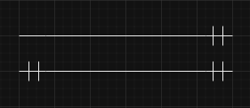 <br />

    1. 1 to 1 단방향
    2. 1 to 1 양방향

  - 1 대 다 / 다 대 1

    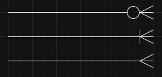 <br />

    1. 1 to 0~N : 하나와 0~N개까지 연결
    2. 1 to 1~N : 하나와 1~N개까지 연결
    3. 1 to N : 하나와 N개까지 연결

  - 다 대 다

    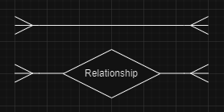 <br />

    1. N to M
    2. N to 1 관계 테이블 1 to N

---

## 정규화

- 정의: 개념적 설계 단계에서 만들어진 ER 스키마 구조를 논리적 설계 단계에서 관계형 스키마로 변형하는데 이 때, 효율적이지 못함. 그래서 정규화 과정을 거쳐 삽입, 삭제, 갱신 이상을 해결해주는 것

- 목적:

  1. 데이터 구조 안정성 최대화
  2. 중복 배제 및 삽입, 삭제, 갱신 이상 방지
  3. 효율적인 테이블 구조

- 제1정규형

  - 정의: 모든 속성은 반드시 하나의 값만 가져야 한다. => _원자성_  
     EX. 하나의 속성이 다중 값을 가지면 안 됨. 이지은의 직업이 배우, 가수, 작곡가 => X

  - 특징
    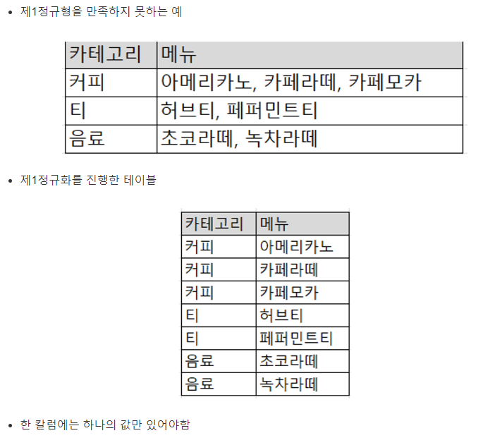 <br />

    - 유사한 속성이 반복되는 경우 통합 (EX. 사이트1, 사이트2, 사이트3 컬럼은 사이트로 통합)

    - 데이터 입력, 수정, 삭제 성능은 반드시 향상되나, 조회 성능은 저하될 수 있다. (엔터티 증가 => JOIN으로 인한 조회 성능 저하)

- 제2정규형

  - 정의: 모든 일반속성은 반드시 주식별자에 종속되어야 한다.
    EX. 주식별자가 주문번호, 음료코드인데, 음료명이라는 일반속성이 음료코드 속성에만 종속되는 테이블 => X : 주문이 되지 않는 음료는 입력 불가한 입력 이상 현상 및 음료명 변경 시에 해당 음료의 주문 데이터가 모두 변경되어야 하는 갱신 이상 현상

  - 특징
    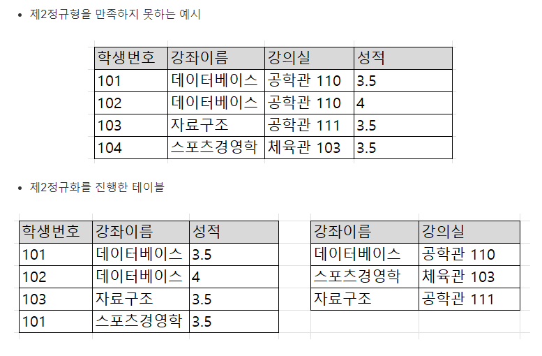 <br />
    - 복합식별자일 때, 모든 식별자 모두 종속되어야 함.
    - 부분함수 종속 제거

- 제3정규형

  - 정의: 주식별자가 아닌 모든 속성 간에는 서로 종속될 수 없다.
    EX. 주식별자가 일련번호인데, 일반속성인 대학명이 또 다른 일반속성인 대학교코드에 종속되어있을 때

  - 특징
    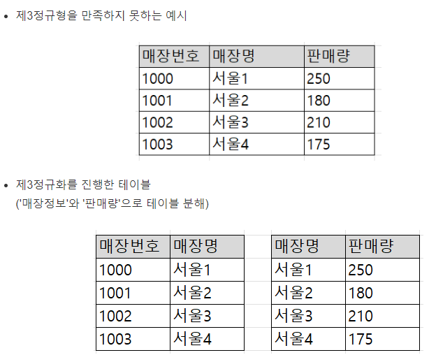 <br />
    - 이행함수 종속 제거

- 단점: 여러번의 JOIN은 정보 조회 시에 성능 저하를 일으킴 => 너무 멀어진 엔터티 간에 관계를 생성하여 성능을 개선할 수 있음. => 반정규화

  [정보처리 실기*데이터베이스06강*정규화](https://youtu.be/RXQ1kZ_JHqg?si=f0OPsoOWnJXSbqca)
  [참조 레퍼런스 1](https://velog.io/@majaeh43/SQL-normalization%EC%A0%95%EA%B7%9C%ED%99%94%EB%9E%80-%EB%AC%B4%EC%97%87%EC%9D%B8%EA%B0%80)
  [참조 레퍼런스 2](https://kkh0977.tistory.com/271)
  [참조 레퍼런스 3](https://superohinsung.tistory.com/111)

---

## 반 정규화

- 정의: 데이터의 조회 성능을 향상시키기 위해 데이터의 중복을 허용하거나 데이터를 그룹핑하는 과정 / 조회 성능은 향상될 수 있으나 입력, 수정, 삭제 성능은 저하되고 데이터 정합성(= 어떤 데이터들이 값이 서로 일치하는 상태) 이슈 발생 가능성 (테이블의 관계가 강결합이어서 같이 조회되는 경우가 대부분일 경우에 고려)

- 원칙: 정규화 과정을 마친 후, 성능상 이슈가 있을 때만 고려

- 테이블 반정규화

  - 테이블 병합 : 일반적으로 JOIN이 많아 성능 측면에서 유리할 경우 고려

    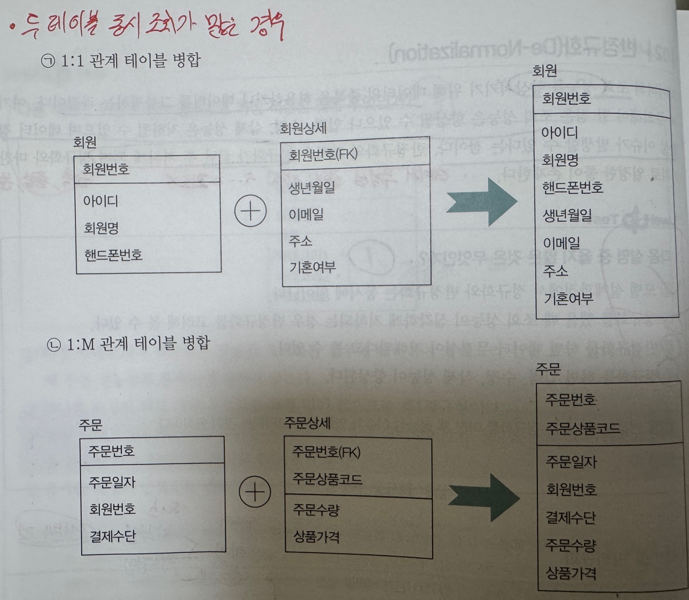 <br />

    1. 1:1 관계 테이블 병합
    2. 1:M 관계 테이블 병합: 1에 해당하는 엔터티의 속성 개수가 많으면, 병합했을 시 중복 데이터가 많아지므로 부적절
    3. 슈퍼 서브 타입 테이블 병합 (ex. 슈퍼 타입: 학생 - 서브 타입: 학부생, 대학원생 : 공통되는 것은 병합)

  - 테이블 분할

    1. 테이블 수직 분할 (속성 분할) : 엔터티의 일부 속성을 별도의 엔터티로 분할 => 1:1 관계 성립 / 한 개의 블록에 더 많은 인스턴스를 저장 가능
       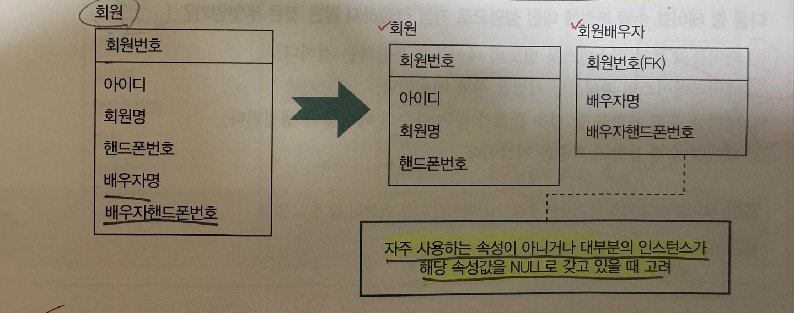 <br />
    2. 테이블 수평 분할 (인스턴트 분할) : 엔터티의 인스턴스를 특정 기준으로 별도의 엔터티로 분할 (ex. 같은 성격의 테이블이지만, 연도 별로 분할) / 관계가 없는 다수의 테이블 생성
       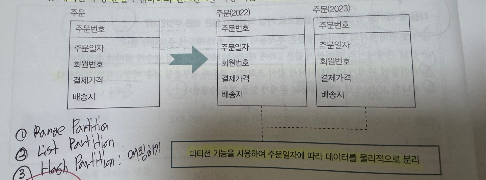 <br />

  - 테이블 추가

    1. 중복 테이블 추가: 데이터의 중복을 감안하더라도 성능상 반드시 필요하면 별도의 엔터티 추가
    2. 통계 테이블 추가
       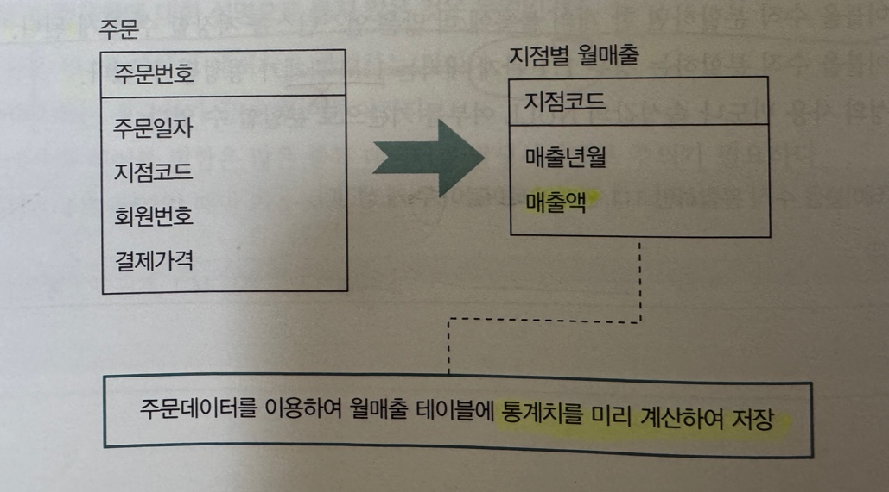 <br />
    3. 이력 테이블 추가
    4. 부분 테이블 추가
       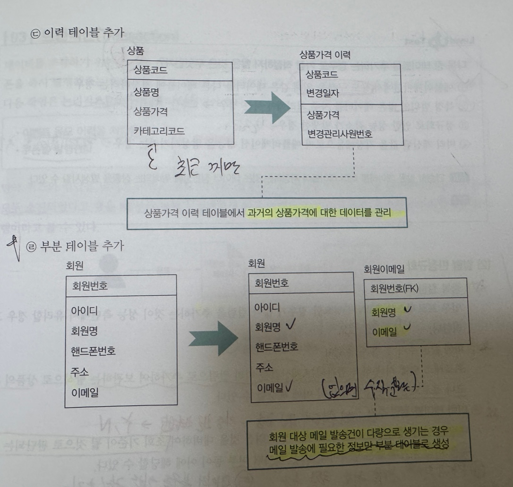 <br />

- 컬럼 반정규화

  1. 중복 컬럼 추가: join이 필요한 경우가 많아 컬럼을 추가하는 것이 성능상 유리한 경우 => join 감소
  2. 파생 컬럼 추가: 프로세스 수행 시 부담되는 것을 미리 컬럼으로 추가하여 보관 (ex. 상품 재고, 프로모션 적용 할인가, 총합계)
  3. 이력 테이블 컬럼 추가: 대량의 이력 테이블 조회 시 성능 저하가 되어 조회 기준으로 될 것으로 판단되는 컬럼 미리 추가 (ex. 주차장 직원 차량 - 최신 차량번호로 등록 => 과거 차량은 N / 현재 차량은 Y오 구분 가능)
  4. PK의 의미적 분리를 위한 컬럼 추가 (ex. 지역 구분을 위한 차량 번호)
  5. 데이터 복구를 위한 컬럼 추가 (ex. 데이터 회복의 관점: 임시적 저장으로 보통 직전값을 일정 기간 내 보관)

- 관계 반정규화(중복 관계 추가): JOIN이 필요한 경우가 많아 중복 관계를 추가하는 것이 성능상 유리한 경우
