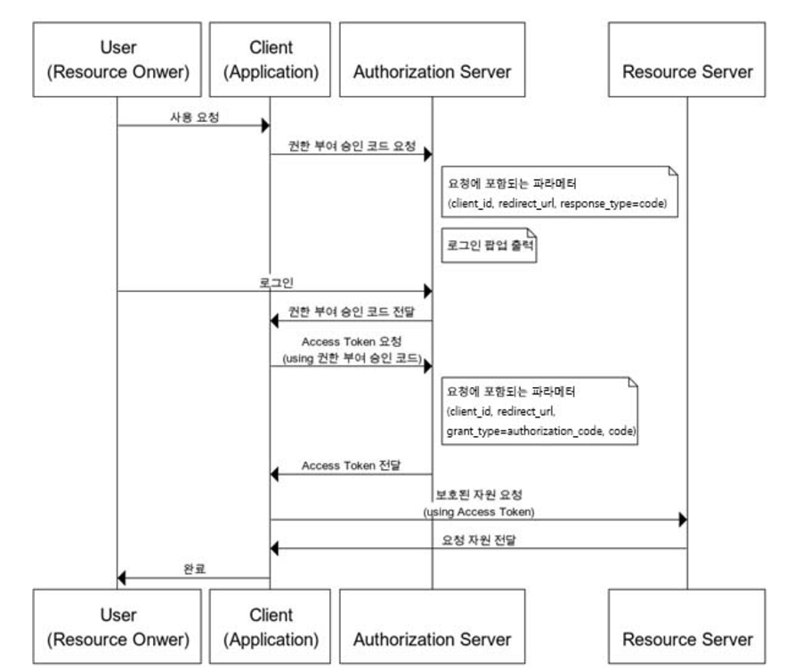
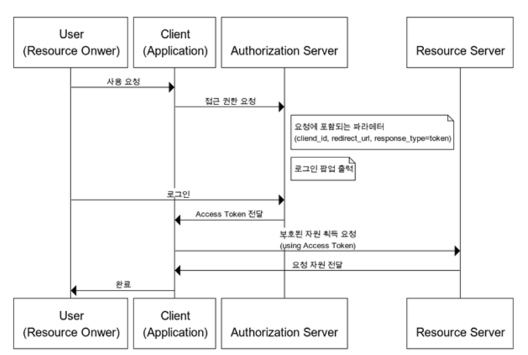
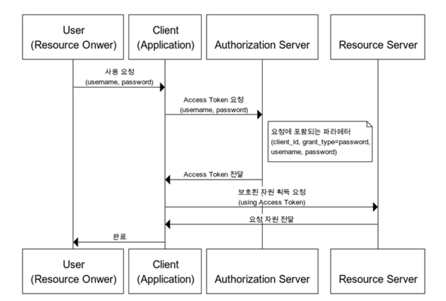
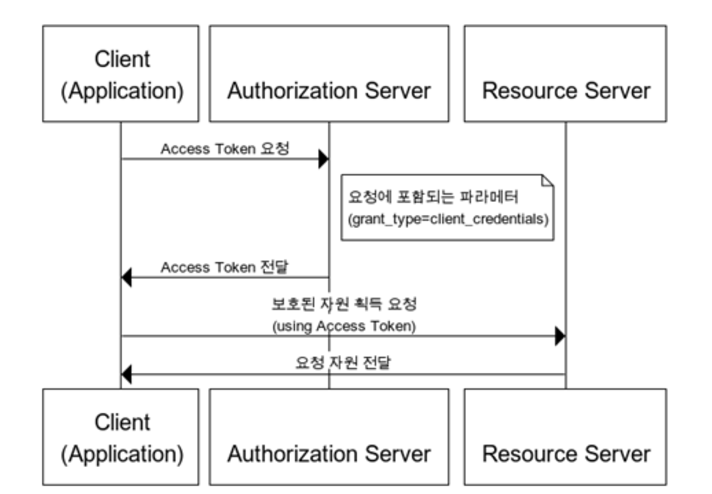
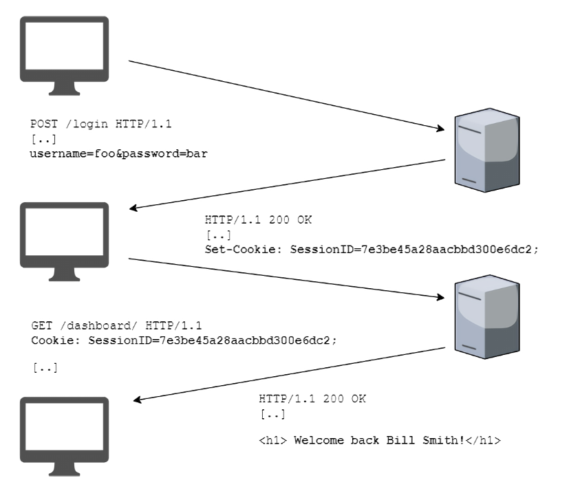
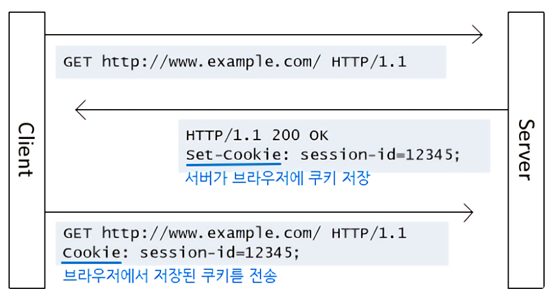
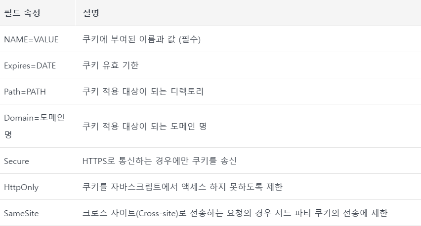

- OAuth 2.0
  ## 정의
  - OAuth 2.0(Open Authorization 2.0, OAuth2), **인증을 위한 개방형 표준 프로토콜**
  - Third-Party 프로그램에게 **리소스 소유자를 대신하여 리소스 서버에서 제공하는 자원에 대한 접근 권한을 위임하는 방식을 제공**합니다.
  - 구글, 페이스북, 카카오, 네이버 등에서 제공하는 간편 로그인 기능도 OAuth2 프로토콜 기반의 사용자 인증 기능을 제공
  ## 핵심 용어
  | Authentication | 인증, 접근 자격이 있는지 검증하는 단계를 말함.                                                                        |
  | -------------- | --------------------------------------------------------------------------------------------------------------------- |
  | Authorization  | 인가, 자원에 접근할 권한을 부여하는 것. 인가가 완료되면 리소스 접근 권한이 담긴 Access Token이 클라이언트에게 부여됨. |
  | Access Token   | 리소스 서버에게서 리소스 소유자의 보호된 자원을 획득할 때 사용되는 만료 기간이 있는 Token                             |
  | Refresh Token  | Access Token 만료 시 이를 갱신하기 위한 용도로 사용하는 Token. 일반적으로 Access Token보다 만료 기간이 김.            |
  ## 각 역할의 위치
  | Resource Owner
  (리소스 소유자, 사용자) | 보호된 자원에 접근할 수 있는 자격을 부여해주는 주체. OAuth 2.0 프로토콜 흐름에서 클라이언트를 Authorize(인증)하는 역할. 인증 완료 후 Authorization Grant(권한 획득 자격)을 클라이언트에게 부여.
  개념적으로는 권한을 부여하는 것이지만, 일반적으로 Authorization Server가 Resourece Owner와 Client 사이에서 중개 역할 수행 |
  | --- | --- |
  | Client | 보호된 자원을 사용하려고 접근 요청을 하는 애플리케이션 |
  | Resource Server | 사용자의 보호돤 자원을 호스팅하는 서버 |
  | Authorization Server | 권한 서버. 인증/인가를 수행하는 서버로 클라이언트의 접근 자격을 확인하고, Access Token을 발급하여 권한을 부여하는 역할 |
  ## 주요 API Parameter
  | client_id, client_secret | 클라이언트 자격증명. 클라이언트가 권한 서버에 등록하면 발급받을 수 있으며, 권한 서버 연동 시 클라이언트의 검증에 사용 |
  | ------------------------ | --------------------------------------------------------------------------------------------------------------------- |
  | redirect_url             | 권한 서버가 요청에 대한 응답을 보낼 url 설정                                                                          |
  | response_type            | 권한 부여 동의 요청 시 포함되는 값으로, 권한 부여 방식에 대한 설정                                                    |
  - code: Authorization Code Grant
  - token: Implicit Grant |
    | state | CSRF 공격에 대비하기 위해 클라이언트가 권한 서버에 요청 시 포함하는 임의의 문자열.
    필수 사항은 아니지만, 클라이언트가 요청 시 state를 포함 시켰다면 권한 서버는 동일한 값을 클라이언트에게 보내야 함. |
    | grant_type | Access Token 획득 요청 시 포함되는 값으로 권한 부여 방식에 대한 설정
  - authorization_code: Authorization Code Grant
  - password: Resource Owner Password Credentials Grant
  - client_credentials: Client Credentials Grant |
    | code | Authorization Code Grant 방식에서 Access Token 요청 시 사용
    권한 서버에서 획득한 Authorization Code를 입력 |
    | token_type | 발행된 Token의 타입. 대표적으로 Bearer, MAX(Message Authentication Code) |
    | expires_in | 토큰 만료 시간 (단위 : 초) |
    | example_parameter | Token 타입에 따른 추가 파라미터 |
  - 추가로 API 요청에 포함되는 Authorization Basic 헤더는 Client 자격증명 관련 데이터로 client_id와 client_secret값을 아래와 같이 Base64 인코딩하여 생성
    `base64(client_id:client_secret)`
  ## 권한 부여 방식
  ### Authorization Code Grant (권한 부여 승인 코드 방식) _- 보편적_
  - 권한 부여 승인을 위해 자체 생성한 Authorization Code를 전달하는 방식으로 쓰임.
  - 간편 로그인 기능에서 사용되는 방식
  - 클라이언트가 사용자를 대신하여 특정 자원에 접근을 요청할 때 사용하는 방식
  - ex. 타사의 클라이언트에게 보호된 자원을 제공하기 위한 인증에 사용
  - Refresh Token 사용 가능
    

    - 권한 부여 승인 요청 시, `response_type=<code>` 으로 요청.
    - 클라이언트는 권한 서버에서 제공하는 로그인 페이지를 브라우저에 출력
    - 해당 페이지를 통해 사용자가 로그인을 하면, 권한 서버는 권한 부여 승인 코드 요청 시 전달받은 `redirect_url`로 `Authorization Code` 전달
    - `Authorization Code`는 권한 서버에서 제공하는 API를 통해 `Access Token`으로 교환
    - Request & Response 예시
      - Step 1: Authorization
      | Request | `(GET)/authorize?
  response_type=code&clinet_id=dsfEG3sd23fsaf&state=xyz&redirect_url=https%3A%2F%2Fclient%2Eexample%3EFc%2fE` |
      | --- | --- |
      | Response | `https//client.example.com/cb?
  code=ESQET32xxEXDxdEGASDE23FSXEF&state=xyz` |
      - Step2: Access Token
      | Request | `(POST)/token
  Authorization: Basic czZCaGRSdfsdR#34dfDSFexfs4dsFDF
  Cotent-Type: application/x-www-form-unlencoded`
      | `grant_type=authorization_code&code=ESQET32xxEXDxdEGASDE23FSXEF&redirect_url=https%3A%2F%2Fclient%2Eexample%3EFc%2fE` |
      | --------------------------------------------------------------------------------------------------------------------- | --- |
      | Response                                                                                                              | `{  |
            "access_token": "2FESETRS34DxdreESceSEgs3AA",
            "token_type": "example",
            "expires_in": 3600,
            "refresh_token": erERFG334DFEr3FXEFA5
            "example_parameter": "example_value"
      }` |

    ### Implicit Grant (암묵적 승인 방식)

    - 자격증명을 안전하게 저장하기 힘든 클라이언트 (JavaScript 등의 스크립트 언어를 사용한 브라우저)에 최적화된 방식
    - 권한 부여 승인 코드 X, 바로 Access Token 발급 (만료기간을 짧게 설정하여 누출 위험 방지)
    - Refresh Token 사용 불가능
    - 권한 서버는 client_secret을 사용하여 클라이언트를 인증 X
    - Access Token을 획득하기 위한 절차가 간소화하여, 응답성과 효율성은 높아지지만, Access Token이 URL로 전달된다는 단점

    

    - 권한 부여 승인 요청 시, `response_type=<token>` 으로 요청.
    - 클라이언트는 권한 서버에서 제공하는 로그인 페이지를 브라우저에 출력
    - 해당 페이지를 통해 사용자가 로그인을 하면, 권한 서버는 권한 부여 승인 코드 요청 시 전달받은 `redirect_url`로 `Access Token` 전달
    - Request & Response 예시
      | Request | `(GET)/authorize?
  response_type=token&clinet_id=dsfEG3sd23fsaf&state=xyz&redirect_url=https%3A%2F%2Fclient%2Eexample%3EFc%2fE` |
      | --- | --- |
      | Response | `https//client.example.com/cb#access_token=ESQET32xxEXDxdEGASDE23FSXEF&state=xyz&token_type=example&expires_in=3600` |

    ### Resource Owner Password Credentials Grant (자원 소유자 자격증명 승인 방식)

    - 클라이언트가 자사 프로그램일 경우 `username`, `password`로 Access Token을 받는 방식
    - 권한 서버, 리소스 서버, 클라이언트가 모두 같은 시스템에 속해있을 때 사용 가능
    - 클라이언트가 타사 외부 프로그램인 경우에 해당 방식 적용 X
    - Refresh Token 사용 가능

    

    - 제공 API를 통해, username, password를 전달
    - Access Token을 받음.
    - Request & Response 예시
      | Request | `(POST)/token
  Authorization: Basic czZCaGRSdfsdR#34dfDSFexfs4dsFDF
  Cotent-Type: application/x-www-form-unlencoded`
      | `grant_type=password&username=joindoe&password=A3ddi3w` |
      | ------------------------------------------------------- | --- |
      | Response                                                | `{  |
            "access_token": "2FESETRS34DxdreESceSEgs3AA",
            "token_type": "example",
            "expires_in": 3600,
            "refresh_token": erERFG334DFEr3FXEFA5
            "example_parameter": "example_value"
      }` |

    ### Client Credentials Grant (클라이언트 자격증명 승인 방식)

    - 클라이언트의 자격증명만으로 Access Token을 획득하는 방식
    - OAuth 2.0의 권한 부여 방식 중 가장 간단한 방식
    - 클라이언트 자신이 관리하는 리소스 혹은 권한 서버에 해당 클라이언트를 위한 제한된 리소스 접근 권한이 설정되어 있는 경우 사용
    - 자격증명을 안전하게 보관할 수 있는 클라이언트에서만 사용
    - Refresh Token 사용 불가능

    !

    - Request & Response 예시
      | Request | `(POST)/token
  Authorization: Basic czZCaGRSdfsdR#34dfDSFexfs4dsFDF
  Cotent-Type: application/x-www-form-unlencoded`
      | `grant_type=client_credentials` |
      | ------------------------------- | --- |
      | Response                        | `{  |
            "access_token": "2FESETRS34DxdreESceSEgs3AA",
            "token_type": "example",
            "expires_in": 3600,
            "example_parameter": "example_value"
      }` |
- HTTP Cookie
  ## 정의
  - 웹 브라우저에서 쿠키(Cookie)란 서버가 사용자의 웹 브라우저에 전송하는 작은 데이터 조각으로, `key=value` 형식의 문자열 데이터 묶음.
  - 브라우저는 이 문자열 데이터 조각들을 저장해놓았다가 동일한 서버에 재요청시 쿠키 데이터를 전송
  - HTTP 프로토콜은 기본적으로 _Stateless(상태 유지 X)_ 한 속성을 가지고 있기 때문에, 서버와 클라이언트 간의 연결 유지를 구현하기 위해서 서로를 인식할 수 있는 식별 데이터가 필요해졌고 그것이 쿠키 데이터 조각.
  - 단점
    - 클라이언트 측에서 관리되기에 악용될 우려
    - 보안에 취약하여 탈취 위험성. ⇒ 비밀번호, 주민번호와 같은 정보 X, 최소한의 정보
    - 트래킹으로 과도하게 사용하여 과한 광도 수단.
  ## 활용도
  - 서버와의 상호작용 뿐만 아니라, 웹사이트의 환경 설정이나 검색 기록 유지하여 사용자의 사용 경험을 제공
  ### 세션 관리
  - 서버 간 일시적인 연결 유지에 이용, 서버에 저장해야 할 로그인, 장바구니, 게임 스코어 등의 정보관리
  - ex. 로그인 유지, 장바구니에 담은 제품 유지 등
  ### 개인화
  - 사용자 선호, 테마 등 사용자의 개인 세팅을 저장, 관리
  - ex. 다크모드 사용, 언어 설정, 순서 최적화
  ### 트래킹
  - 분석 및 광고 개제를 위해 웹사이트 내 사용자 행동 기록 , 관리
  - ex. 분석데이터 수집, 리타게팅 광고 기여
  ## 관리 체제 : 브라우저
  - 크롬, 엣지, 파이어폭스 등등에서 동일한 사이트에 들어가서, 동일한 내용의 쿠키 값을 저장하여도 해당 쿠키들은 별개의 쿠키 (종속적)
  - 웹사이트 도메인에 따라 또는 웹사이트 페이지 경로에 따라 저장되도록 각기 다르게 지정
    - [`example.com/page`](http://example.com/page) 인데 서버에서 쿠키값을 `test=1; path=/home` 이라고 응답하게 되면, 브라우저는 `/home` 경로에 쿠키를 적재하게 되어, `/home` 페이지에서만 `test`라는 쿠키 데이터를 사용 가능
    - 개발자 도구 - Application - Cookies
  ## 로그인 과정 (세션 쿠키)
    
    
    1. 로그인(/login) 화면에서 클라이언트가 username 과 password를 입력하고 서버에 제출(요청)
    2. 서버는 DB를 조회하여 해당 유저 정보 데이터를 가져와 검증하고 세션 메모리에 저장한다. 그리고 이 세션 데이터를 식별하는 **세션 아이디(SessionID)를 쿠키로 만들어 반환**한다. (Set-Cookie)
    3. 클라이언트는 응답 받은 쿠키를 브라우저에 저장해 놓는다. 그리고 나중에 대시보드 창(/dashboard)에 진입하기 위해서 서버에게 요청을 보낼때 쿠키를 같이 실어 보낸다.
    4. 서버는 클라이언트로부터 온 쿠키에 들은 세션 아이디를 파싱하여 올바른지 검증하고, 로그인한 회원이면 그에 걸맞는 대시보드 페이지를 응답한다.
    - 서버에서 개인 회원 정보와 같은 민감한 정보를 그대로 클라이언트에 보내면, 다른 사람도 얼마든지 볼 수 있다는 위험성 때문에, **따로 세션 키를 서버에서 만들어서 DB에 저장해두고 sessionId 값으로 보냄.** **클라이언트는 그 sessionId를 저장해두고 요청할 때마다 서버에 전달**
    
    ## HTTP Cookie Header
    
    
    
    ### Cookie (request header)
    
    - HTTP 요청 시 클라이언트에서 서버로 전달하는 쿠키 헤더
    - 서버의 세션 상태를 담은 SessionID 혹은 각종 클라이언트 정보를 담음.
    
    ### Set-Cookie (response header)
    
    - 서버에서 클라이언트로 전달하는 쿠키 헤더
    - 클라이언트는 이 정보를 바탕으로 쿠키를 만들어 브라우저에 저장
    
    ### 쿠키 저장 방식
    
    - `key=value` 형태로 저장되는 문자열로서, 여러개의 데이터를 **콤마(,)**로 열거하여 저장해 구분
    - 유효 기간이나 도메인 등을 설정한 파라미터들을 **세미콜론(;)**을 통해 열거
    
    ```powershell
    sessionId=abcde1234; expires=Sat, 26-Dec-2020 00:00:00 GMT; path=/; domain=.google.com; Secure**,** name=인파; domain=inpa.tistory.com**,** test=value
    ```
    
    ## HTTP Cookie parameter
    
    - `key=value`의 문자열이지만, 각 쿠키값에 적용되는 쿠키의 유효 기간이나 도메인 설정 등을 파라미터를 통해 추가
    - 이 파라미터들은 클라이언트(브라우저)에 적용되는 속성이며, 서버에서 응답할 때 설정하여 응답 가능
    
    
    
    ### 쿠키 생명 주기
    
    - `expires`와 `max-age`로 만료일 설정. 후에는 삭제
    - `expires=Sat, 26-Dec-2020 04:45:32 GMT`
    - `max-age=3600` - 초 단위 (0이나 음수면 쿠키 삭제)
    - **세션 쿠기**: 만료 날짜를 생략하면 브라우저 종료시까지 유지.
    - 영속 쿠키: 만료 날짜를 입력하면 해당 날짜까지 유지
    
    ### 쿠키 Path
    
    - 쿠키에 경로를 설정하면, 해당 경로에서만 쿠키 사용 접근 가능
    - 해당 경로의 하위 경로까지 모두 포함. 루트 경로(/) 설정하면 모든 경로에 쿠키 유효
    - path을 입력하지 않으면 루트 경로로 자동 입력
    - 쿠키 범위를 작게 입력하면 보안 강화
    - 예시
        - `/home/level1` ⇒ O
        - `/home/level1/level2` ⇒ O
        - `/hello` ⇒ X
    
    ### 쿠키 Domain
    
    - 쿠키에 도메인을 설정하면, 해당 도메인 페이지에서만 쿠키 사용 접근 가능
    - 해당 도메인의 서브 도메인까지 모두 포함.
    - 도메인 생략 시, 현재 문서 기준 도메인으로만 적용 (서브 도메인 X)
    - 퍼스트 파티 쿠키: 현재 도메인에서 설정한 쿠키
    - 서드 파티 쿠키: 다른 도메인으로 설정된 쿠키
    - 예시
        - `.example.com` ⇒ O, (도메인 앞에 점 : 서브 도메인 허용)
        - [`example.com`](http://example.com) ⇒ O (서브 도메인 허용 X)
        - [`www.example.com`](http://www.example.com) ⇒ O
    
    ### 쿠키 도메인 종류 : 서드 파티 쿠키
    
    - 쿠키 도메인 파라미터를 전혀 다른 도메인으로 설정된 쿠키
    - 구글 애드센스와 같은 스크립트만 등록되어 있다면 여러 개의 사이트에서 쿠키를 생성
    - 퍼스트 파티 쿠키 ex:  Example 사이트에 방문해서 로그인을 했다면, 다음 로그인할 때 정보를 다시 입력해야 하는 번거로움을 줄일 수 있도록 Example 사이트에서 사용자의 웹 브라우저로 Cookie A가 부여.
    - 서드 파티 쿠키 ex: 해당 웹페이지 우측 배너 광고 표시되는데 해당 배너는 Adserver 사이트에 전달되고 있기에, 해당 배너를 통해 사용자의 웹 브라우저에 다른 도메인 파라미터를 갖는 Cookie B
    - 타깃 마케팅 광고 목적
    - ex. 신발 쇼핑몰 사이트 자주 방문 시, 쿠키가 저장되어 구글 애드센스가 이를 가져가 다른 사이트에 배너 광고에서 신발 광고가 화면에 나타남.
    
    ### 쿠키 Secure
    
    - 활성화 시, **HTTPS** 사용 시에만 쿠키 정보 전달
    - **미적용 시에는 HTTP, HTTPS 구분 X**
    
    ### 쿠키 HttpOnly
    
    - JavaScript에서 쿠키 사용 접근을 제한
    - JS로 해커가 쿠키 탈취 X, XSS 공격 방지
    
    ### JavaScript로 쿠키 접근 방지 방법
    
    - 쿠키는 서버에서 만들어 반환하여야 클라이언트가 사용할 수 있는 것은 아님.
    - [클라이언트에서도 만들어 사용 가능. 개발자 도구나 JS에서 쿠키를 만들어 서버에 전달](https://inpa.tistory.com/entry/JS-%F0%9F%93%9A-%EC%BF%A0%ED%82%A4Cookie-%EB%8B%A4%EB%A3%A8%EA%B8%B0)
    
    ```jsx
    document.cookie = "user=John; path=/; expires=Tue, 19 Jan 2038 03:14:07 GMT";
    alert(document.cookie);// 모든 쿠키 보여주기
    ```
    
    ### 쿠키 SameSite
    
    - 서드 파티 쿠키의 보안적 문제를 해결하기 위한 속성
    - XSRF, CSRF 공격 방지
    - 요청 도메인과 쿠키 정보 내의 도메인이 다른 크로스 사이트로 전송하는 요청에 대해 제한
    - Parameter 값 (서드 파티 쿠키에 한정 - 퍼스트 파티 쿠키는 항상 전송)
        - None : 쿠키는 크로스 사이트 요청의 경우에 항상 전송 (SameSite 미적용 쿠키)
            - Secure가 설정된 쿠키여야 함.
        - Strict: 크로스 사이트 요청에 항상 전송 X
        - Lax: 몇 가지 예외적 요청을 제외하고는 미전송
            - 사용자가 `a` 태그를 클릭하여 302 리다이텍트를 하는 경우
            - Js에서 `window.location.replace` 등으로 인해 자동으로 이루어지는 이동의 경우
            - `iframe`, `img` 태그를 문서에 삽입함으로서의 http 요청은 전송 제한
            - `GET` 요청에 대해서는 쿠키 전송. `POST`, `DELETE` 요청은 제한
