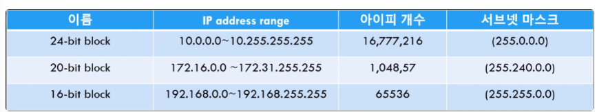

- AWS
  - 클라우드 서비스 플랫폼으로, 컴퓨팅, 스토리지, 데이터베이스, 네트워크 등을 제공
  - VPC (Virtual Private Cloud)
    ### 정의
    - AWS에서 제공하는 **가상 네트워크**
    - AWS 클라우드에서 사용자가 독립적이고 안전한 네트워크를 설정할 수 있도록 해줌.
    ### 특징
    - **독립적인 네트워크 공간**: 특정 IP 주소 범위(예: 10.0.0.0/16)를 갖는 독립적인 네트워크를 제공.
    - **서브넷**: VPC를 퍼블릭 서브넷과 프라이빗 서브넷으로 나눠 트래픽을 분리.
    - **보안**: 보안 그룹, 네트워크 ACL 등을 사용해 접근 제어 가능.
    - **인터넷 연결**: VPC에 **Internet Gateway**를 연결하면 **퍼블릭 서브넷 내 리소스가 인터넷에 연결.**
    ### 주 용도
    - 사용자만 접근할 수 있는 **네트워크 공간**을 구성하여 애플리케이션을 안전하게 배포.
    - 데이터베이스, 애플리케이션 서버, 웹 서버 등을 네트워크 계층별로 분리.
  - Intenet Gateway (IGW)
    ### 정의
    - **AWS VPC에서 퍼블릭 서브넷에 있는 리소스(예: EC2 인스턴스)가 인터넷과 통신할 수 있도록 연결을 제공하는 네트워크 컴포넌트.**
    - 즉, **VPC 내부의 네트워크를 외부 인터넷에 연결하는 출입구 역할.**
    ### **특징**
    1. **양방향 트래픽 허용**:
       - Outbound Traffic : 내부 리소스가 인터넷으로 나가는 트래픽.
       - Inbound Traffic : 외부에서 내부 리소스에 접속하는 트래픽.
    2. **내부 트래픽 변환 없음**:
       - 트래픽을 변환하지 않으며, 연결된 EC2 인스턴스가 **퍼블릭 IP** 또는 **Elastic IP**를 가지고 있어야 인터넷에 액세스 가능.
    3. **VPC 단위로 작동**:
       - 하나의 VPC에는 하나의 Internet Gateway만 연결.
    ### **구성 및 동작**
    1. **VPC와 연결**:
       - Internet Gateway는 특정 VPC에 연결되어 작동.
       - VPC에 IGW를 연결하지 않으면 인터넷 연결이 불가능.
    2. **라우팅 테이블 설정**:
       - 퍼블릭 서브넷의 라우팅 테이블에 다음과 같은 항목을 추가:
         ```makefile
         대상: 0.0.0.0/0
         대상지: Internet Gateway
         ```
    3. **퍼블릭 IP/Elastic IP 필요**:
       - 인터넷과 통신하려면 EC2 인스턴스에 퍼블릭 IP 또는 Elastic IP가 존재.
       - 사설 IP만 있는 인스턴스는 IGW를 통해 인터넷에 접근 불가능.
    ### **사용 사례**
    1. **퍼블릭 서브넷의 EC2**:
       - 웹 서버(예: NGINX, Apache) 또는 애플리케이션 서버를 외부 사용자들이 인터넷을 통해 접근하도록 설정.
    2. **소프트웨어 업데이트**:
       - 퍼블릭 서브넷의 리소스가 운영체제 업데이트 또는 외부 리포지토리에서 소프트웨어 패키지를 다운로드.
    ### **Internet Gateway vs NAT Gateway**
    - **Internet Gateway**: **퍼블릭 서브넷에서 사용**하며, 리소스가 인터넷과 직접 통신하도록 지원.
    - **NAT Gateway**: 프라이빗 서브넷의 리소스가 **인터넷으로 나가는 트래픽만** 허용. **외부에서 프라이빗 서브넷 리소스에 직접 접근은 불가능.**
    ### **설정 절차**
    1. **Internet Gateway 생성**:
       - AWS Management Console > VPC > Internet Gateway > "Create Internet Gateway".
    2. **VPC에 연결**:
       - 생성된 IGW를 특정 VPC에 연결.
    3. **라우팅 테이블 수정**:
       - 퍼블릭 서브넷의 라우팅 테이블에 IGW를 대상으로 추가.
  - EC2
    ### 정의
    - AWS의 클라우드에서 가상 머신(Virtual Machine)을 제공하는 서비스.
    - **서버 역할**을 하며 **애플리케이션 실행, 데이터 처리, 웹 서비스 호스팅 등을 수행.**
    ### 특징
    - **확장성**: 서버 용량을 쉽게 늘리거나 줄일 수 있음 (스케일 업/다운).
    - **다양한 인스턴스 타입**: 용도(웹 서버, 데이터베이스, 머신러닝 등)에 따라 CPU, 메모리, 스토리지 구성 가능.
    - **유연한 운영 체제**: Linux, Windows 등 다양한 OS 선택 가능.
    - **보안**: 보안 그룹으로 네트워크 접근 제어, SSH 키를 이용한 인증 방식.
    ### 주 용도
    - 웹 서버, API 서버, 데이터베이스 서버 등 다양한 역할로 활용.
    - 고성능 컴퓨팅 작업(예: 머신러닝, 데이터 분석).
  - VPC와 EC2의 관계
    1. **VPC는 EC2가 위치할 네트워크 환경을 제공**:
       - **EC2 인스턴스는 반드시 VPC 안에서 생성.**
       - 퍼블릭 서브넷의 EC2는 인터넷에 연결 가능하고, 프라이빗 서브넷의 EC2는 내부 통신만 가능.
    2. **보안과 접근 관리**:
       - **EC2 인스턴스의 보안은 VPC의 보안 그룹과 네트워크 ACL에 의해 관리.**
       - ex. 웹 서버용 EC2는 80번(HTTP), 443번(HTTPS) 포트를 열고, SSH 접근을 위한 22번 포트를 추가로 열 수 있음.
    3. **라우팅과 인터넷 연결**:
       - VPC의 라우팅 테이블과 인터넷 게이트웨이를 통해 EC2의 인터넷 연결 여부가 결정.
       - NAT Gateway를 설정하면 프라이빗 서브넷의 EC2도 인터넷 액세스를 제한적으로 허용.
    ***
    ### 예시
    1. **퍼블릭 서브넷의 EC2**: 웹 서버(예: NGINX, Apache)로 설정되어 인터넷에서 직접 접근 가능.
    2. **프라이빗 서브넷의 EC2**: 데이터베이스 서버로 설정되어 애플리케이션 서버와만 통신.
- 리전과 가용영역
  - **리전(Region)**
    - AWS 데이터 센터가 지리적으로 분산된 구역
    - ex. 서울 리전(ap-northeast-2).
  - **가용영역(AZ: Availability Zone)**
    - 한 리전에 여러 개의 독립된 데이터 센터가 존재하며, 이를 가용영역.
    - AZ 간에는 지연 시간이 짧은 연결이 되어 있습니다.
  - **VPC**와 **EC2**는 특정 리전 및 가용영역 내에서 설정되므로, 리전 선택은 서비스 성능과 사용자 접근성을 결정짓는 중요한 요소.
- 서브네팅
  ### 서브넷
  - 클래스를 할당받아 사용할 시, 호스트의 낭비같은 비효율성 문제로 네트워크 장치들의 수에 따라 효율적으로 사용할 수 있는 것
  - **IP 주소에서 네트워크 영역을 부분적으로 나눈 부분 네트워크**
  ### 서브넷 마스크
  - 서브넷을 만들 때 사용.
  - IP 주소 체계의 `Network ID`, `Host ID`를 분리하는 역할.
  - 기본 서브넷 마스크
    - `A Clsss` : `255.0.0.0`
    - `B Class` : `255.255.0.0`
    - `C Class` : `255.255.255.0`
  - ex. C Class IP 주소, `192.168.32.0`
    - C class 서브넷 마스크 : `255.255.255.0` ⇒ AND 연산
    - = `192.168.32.0/24` **(`/24` - cidr 표기법)**
    - `/24` : 해당 IP의 서브넷 마스크의 왼쪽에서부터 24개가 1
      - `11111111.11111111.11111111.11111111.00000000`
  ### 서브넷팅 (↔ 슈퍼넷팅)
  - IP 주소 낭비를 방지하기 위해 **원본 네트워크를 여러개의 서브넷으로 분리하는 과정**
  - 서브넷 마스크의 bit 수를 증가시킴.
    - 1씩 증가 시, 할당할 수 있는 네트워크 2배수 증가. 호스트 수 2배수 감소
    - CIDR 블럭 : 서브넷들
  - ex. `192.168.32.0/24` 의 서브넷 마스크 bit 수 증가 ⇒ `192.168.32.0/25`
    - `/24` 였을 때는 1개의 네트워크와, 254*(256 - 2)*개 호스트 가능
      - 첫번째 주소 : Network Address
      - 마지막 주소 : Broadcast
    - `/25` 일 때는, HOST ID를 나타내느 부분이 8개 비트에서 7개 비트로 감소
    - 126*(128-2)*개의 호스트와 2개의 네트워크 사용 가능
      - 첫번째 서브넷의 host 할당 가능 : `192.168.32.1` ~ `192.168.32.126`
      - 마지막 서브넷의 host 할당 가능 : `192.168.32.129` ~ `162.168.32.254`
  ### AWS CIDR
  - 일반적인 서브네팅과 다르게, 네트워크 주소와 브로드캐스트 주소 2개를 제외하는 IP 범위가 아닌, **AWS에는 따로 자체 클라우드에서 설정하는 IP가 있기에 총 5개 제외**
    

- 라우팅
  ### 정의
  - 패킷에 포함된 주소 등의 상세 정보를 이용하여, **데이터 또는 메세지를 체계적으로 다른 목적지인 네트워크에 전달하는 경로 선택 (Path Determination) 그리고 스위칭 (Switching)하는 과정**
    - 패킷 : 데이터를 전송하는 하나의 단위
    - 여러 라우터가 해당 과정을 반복하며 목적지 네트워크에 이름.
  - **데이터가 전달되는 과정에서 여러 네트워크들을 통과해야하는 경우가 생기는데, 여러 네트워크들의 연결을 담당하는 라우터 장비가 데이터의 목적지를 확인 후 길을 찾아 전달해주는 과정**
  ### 필요한 것
  - **출발지와 목적지의 네트워크 정보**
  - **목적지로 가는 모든 경로**
  - **최적 경로** : 해당 경로 저장하는 곳을 Routing Table
  - **지속적인 네트워크 상태 확인** : 경로를 알지만 그 경로가 다운된 상태라서 사용 불가일 때를 고려하여, Routing Table에 저장된 경로로 전달이 가능한 상태인지 지속적으로 네트워크 상태를 확인하여 **올바른 최신 정보 유지**
  ### Routing Table
  - 목적지로 가는 모든 경로 중 최적 경로를 패킷을 전달할 때 바로 참고하여 사용할 수 있도록 따로 모아두는 공간
  ### 정적 라우팅
  - 수동으로 라우팅 테이블을 만드는 방법
  - 입력된 라우팅 정보가 수정하기 전에는 이전의 값이 변하지 않고 고정된 값을 유지하며, 라우팅 정보는 관리자가 수동으로 입력
  - 라우터 자체 부담이 줄어들어, 빠르며 안정적이고 메모리 소모가 적음. 라우터간의 데이터 교환이 없어 네트워크 대역폭 절약, 보안 강화
  - 경로를 일일이 수동으로 추가해야하여 번거로움. 경로에서 장애 발생 시, 전체에 장애 발생 가능
  ### 동적 라우팅
  - 접하는 라우터들이 라우팅 정보를 서로 교환하여 라우팅 테이블을 자동으로 만드는 방법
  - 라우터가 서로 라우팅 정보를 주고 받아, 자동으로 라우팅 테이블을 작성하기 때문에, 관리자는 초기 설정만 해주면 되어서 간단
  - 네트워크 규모가 커져도 자동으로 라우팅 테이블을 갱신하여 규모가 큰 네트워크에서 사용 가능
  - 다른 라우터들과의 지속적 통신으로 많은 대역폭 소비
- 사설 IP 주소
  ### 사설 IP (로컬 IP)
  - 공유기를 사용한 인터넷 접속 환경일 경우, 국가 기관에서 부여받아 통신 3사인 ISP가 가입을 한 소비자에게 공인 IP를 제공하고, 해당 IP는 공유기까지의 연결, 이후에는 사설 IP들을 우리가 사용.
  - 어떤 네트워크 내에서 내부적으로 사용되는 고유한 주소
  - 공인 IP는 전 세계에서 유일하지만, 사설 IP는 하나의 네트워크에서만 유일. (다른 공인 IP에서는 동일한 사설 IP는 있을 수 있음.) ⇒ **절약 가능**
  ### 사설망
  - 사설 IP들을 그룹으로 묶는 방법
  - ex. 반 : 사설망 / 반장 : 게이트웨이 / 학생: 전자기기 / 학교: 인터넷
  - **지정된 대역의 아이핀만 사용 가능**
    

- 포트포워딩
  - 공유기의 포트를 통해, 해당 공유기와 연결된 기기들의 특정 포트에 진입할 수 있게 하는 기능
  - ex. 공유기의 180 포트로 접속 시에, 핸드폰의 5000 포트에 접속 / 280 포트로 접속 시에, 컴퓨터의 5000포트에 접속함. 이때, 180, 280등을 지정하는 작업이 포트포워딩
- NAT 프로토콜
  ### NAT (사설망 ↔ 외부 통신)
  - 외부 인터넷이 주소 번호가 같은 사설 IP를 각각 특정하여 웹페이지를 띄우거나 할 수 있음. 이때 사용되는 원리 NAT(Network Address Translation)
  - IP 주소 혹은 IP 패킷의 TCP/UDP port 숫자를 변환 및 재기록하여 네트워크 트래픽을 주고받는 기술
  - 공인망과 사설망의 트래픽을 주고받을 시 사설 IP를 공인 IP로 변환하는 것
    
    
    
    
    - 인터넷 주소 번역 기능
        - 공유기(라우터)에 연결되어있는 각 사내 컴퓨터들의 사설 IP를 받아와, 유일한 공인 IP로 변환. 그리고 외부 인터넷으로 공인 IP 주소정보를 송신
        - 인터넷 정보가 회사 공유기로 오면서, 이전 요청 정보를 모두 기억하는 공유기는 그대로 사설 IP에 전달
- 포트 번호
  ### 정의
  - **논리적인 접속장소**로, 인터넷 프로토콜인 TCP/IP를 사용할 때 클라이언트 프로그램이 네트워크 상의 특정 서버 프로그램을 지정하는 방법
  - 네트워크 상에서 통신을 할 때 IP 주소를 바탕으로 해당 서버가 있는 컴퓨터에 접근하게 되는데,하나의 IP에서 여러 애플리케이션을 실행할 경우, 컴퓨터에는 여러 개의 서버가 실행하게 된다. 이때 해당 컴퓨터를 지정해주는 것 (웹 서버 - port no: 443, 메일 서버 - port no: 25)
    
