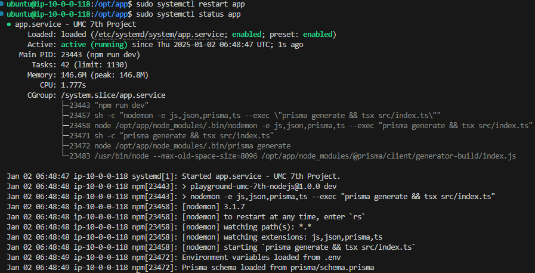

## 문제 상황

**상황**

- git action 도중에 과부화가 오는 부분이 있어 램 메모리가 부족하여 서버가 다운되는 현상이 발생함.
- Not connect port 22 에러가 남. => SSH

**해결 방법**

- EC2 인스턴스를 삭제.
- EC2 인스턴스 재생성 및 탄력적 IP 재연결
- EC2 인스턴스 연결 기능을 mysql 등등 설정 후, **스왑 메모리 생성**
- https://diary-developer.tistory.com/32
- 스왑 메모리 생성 후, 테스트 코드 : free
- SSH 시도 후 서버 성공.
- workflow에 딜레이 시간 설정 (해당 위치에 알아서.)

```yml
StartLimitIntervalSec=60
StartLimitBurst=5
RestartSec=10
```

- git action 후 성공

**주의 사항**

- 키 페어에 기록이 남는 현상이 발생하여 서버 에러가 날 것.
- ssh 폴더에 kwown_hosts에 이전 키 기록이 남아있기 때문.
- 해당 기록들 모두 삭제 후 재시작

## 성공 기록


